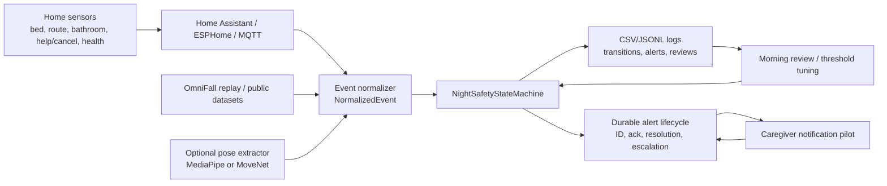

# Senior Night Safety Architecture

## Core Runtime

- Home Assistant owns device discovery, dashboards, automations, and physical sensor reliability.
- This repo owns normalized event schemas, safety state transitions, alert payloads, and review logs.
- Camera support is optional and should emit derived pose/feature events, not raw video by default.
- Bathroom video is disabled by default; bathroom state should come from door, mmWave, PIR, pressure, or manual signals.

## Runtime Flow

1. Sensors publish to Home Assistant via ESPHome native API or MQTT.
2. Home Assistant or a small bridge writes normalized sensor events.
3. `NightSafetyStateMachine` consumes events in timestamp order.
4. Each event produces a decision with state, severity, reason codes, recommended action, confidence, and debug durations.
5. Notification code sends only low/urgent caregiver messages after observation-only acceptance criteria are met.
6. Every alert is reviewed and fed back into threshold tuning.

Alert lifecycle state is atomically persisted in the live log directory. MQTT
redelivery or a bridge restart does not re-notify the same detector event.
Caregiver acknowledgement stops the configured backup timer; resolution records
the responder and outcome as a separate action.

## Minimum Event Names

- `bed_occupied`
- `person_present`
- `route_motion`
- `bathroom_occupied`
- `door_open`
- `fall_suspected`
- `floor_level_posture`
- `no_motion`
- `manual_help_pressed`
- `manual_cancel_pressed`
- `sensor_offline`
- `sensor_online`
- `caregiver_acknowledged`
- `alert_resolved`
